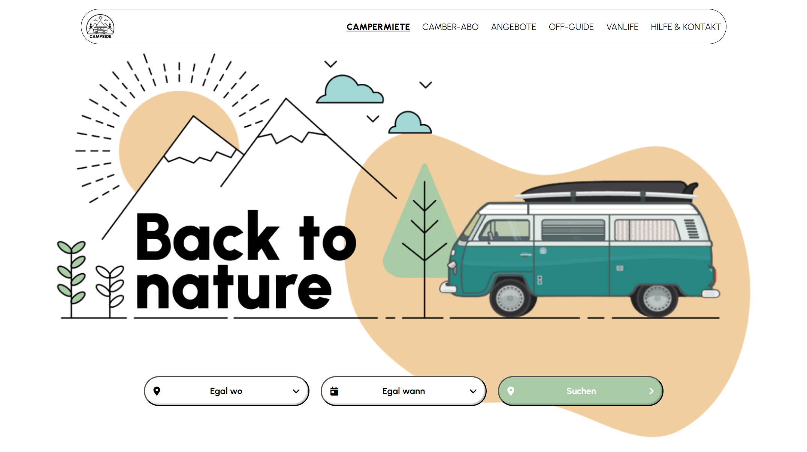
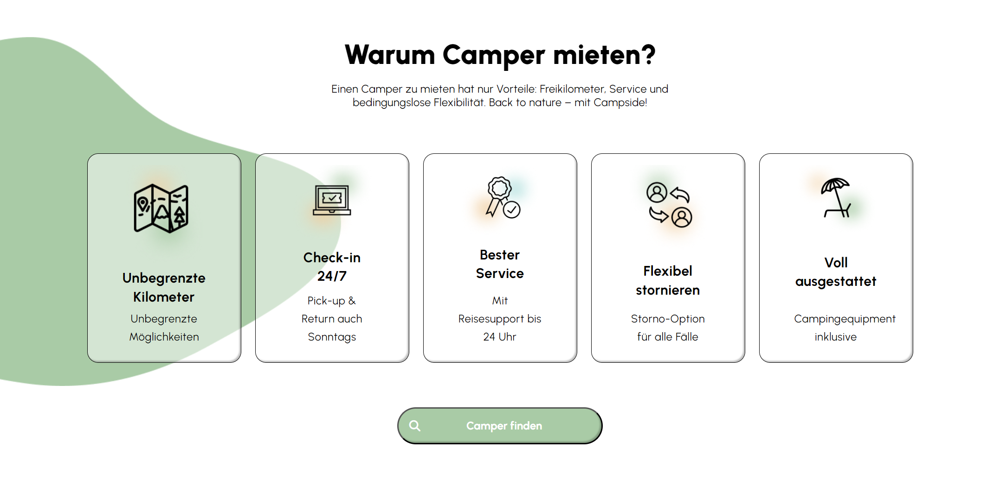
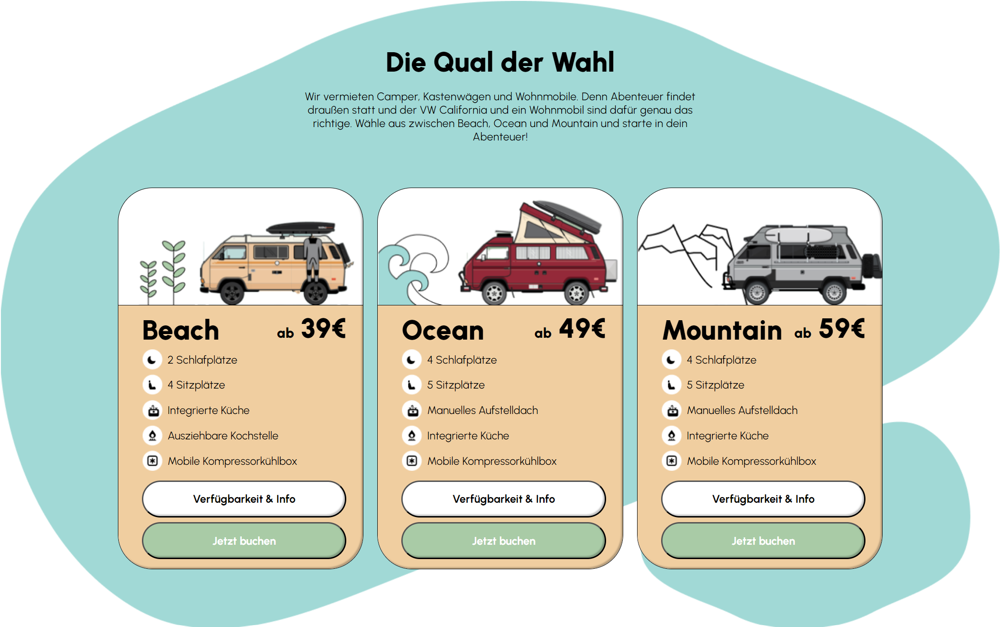

# Back to Nature Website

## Projektbeschreibung

"Back to Nature" ist eine Website für die Vermietung von Campern und Vanlife. Das Projekt enthält mehrere Abschnitte:
- Startseite mit Camper-Suche
- Informationskarten mit den Vorteilen der Camper
- Auswahl an Camper-Modellen und deren detaillierte Beschreibung
- Responsive Design für verschiedene Bildschirmgrößen

Das Projekt wurde mit HTML, SCSS und JavaScript erstellt.

## Struktur

Das Projekt besteht aus folgenden Hauptdateien und Verzeichnissen:
- `index.html` — die Hauptdatei mit der HTML-Struktur der Website.
- `assets/css/style.css` — generiertes CSS aus SCSS.
- `assets/scss/` — Verzeichnis mit SCSS-Dateien:
  - `klassen.scss` — enthält die Stile für die Klassen.
  - `mixins.scss` — enthält Mixins zur Vereinfachung des Codes.
- `assets/img/` — Verzeichnis mit Bildern, die auf der Website verwendet werden.

## Verwendete Technologien

- **HTML5**: Struktur der Website.
- **SCSS**: für die Gestaltung mit Mixins und Variablen.
- **JavaScript**: interaktive Elemente der Website.
- **FontAwesome**: Symbole für Schaltflächen und Navigationselemente.
- **Google Fonts**: Schriftart "Urbanist".

## Responsive Design

Die Website ist für verschiedene Bildschirmgrößen optimiert:
- Desktop
- Tablet
- Mobile Geräte

## Kontaktinformationen

Falls Sie Fragen oder Vorschläge haben, können Sie mich kontaktieren:
- **E-Mail**: barshchevskak@gmail.com
- **GitHub**: [TinaBK24](https://github.com/TinaBK24)

## Screenshots

### Startseite

### Informationskarten

### Camper-Modelle

